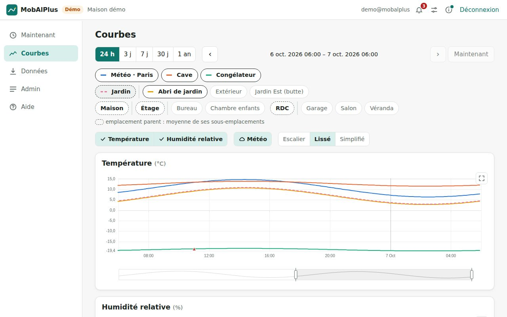
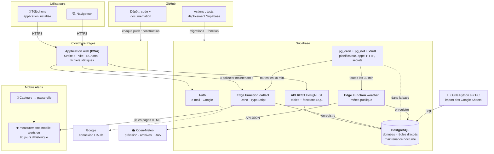
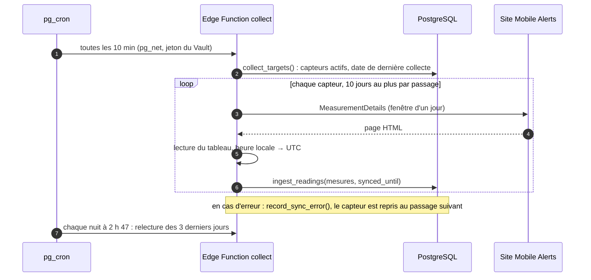
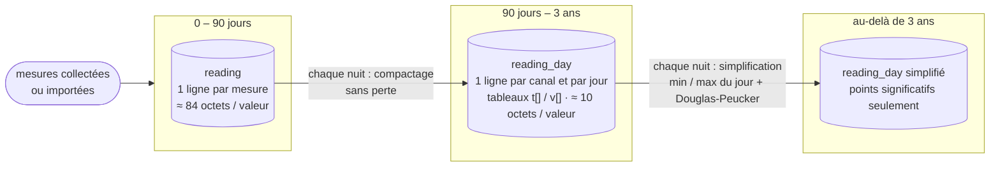
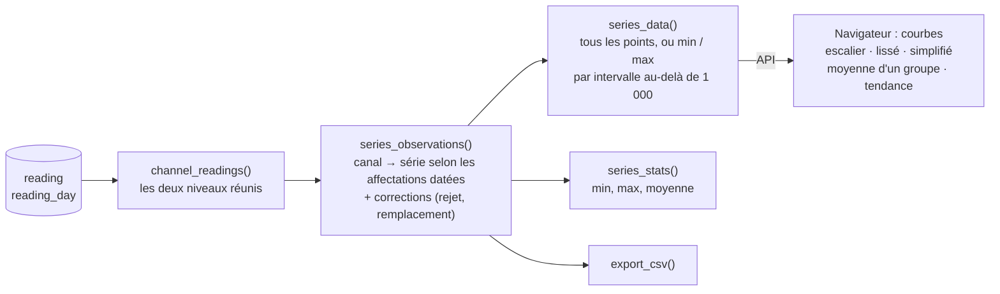
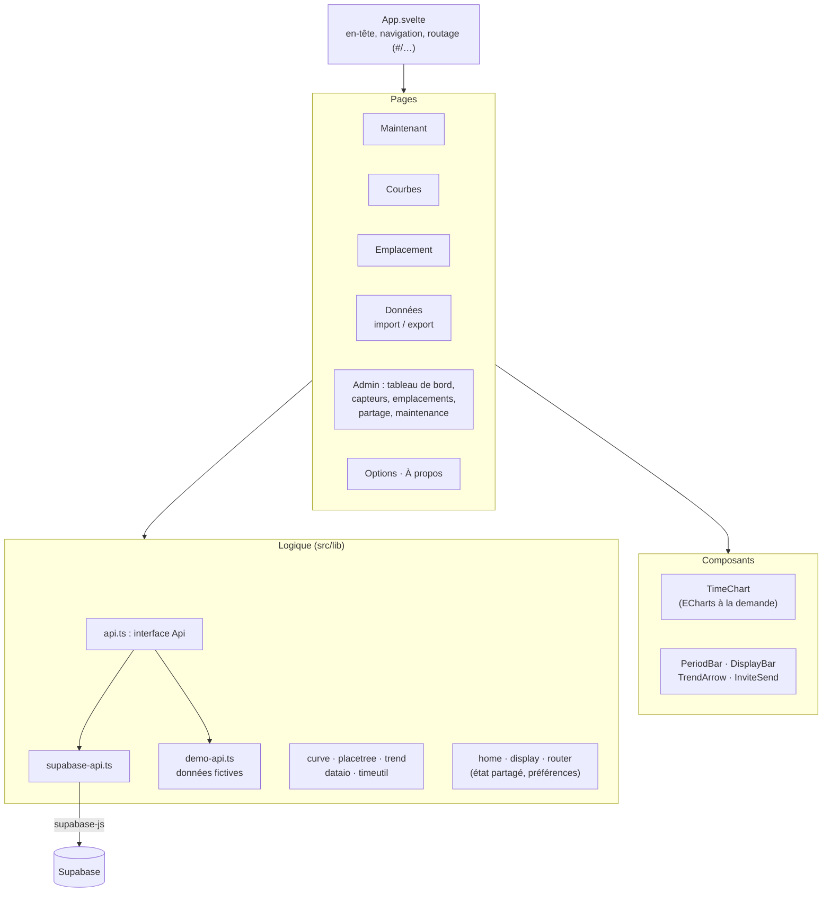
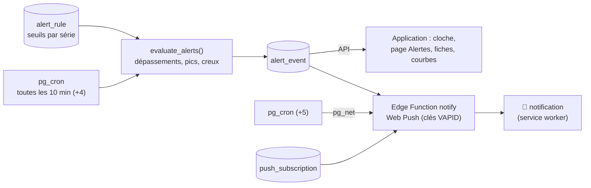
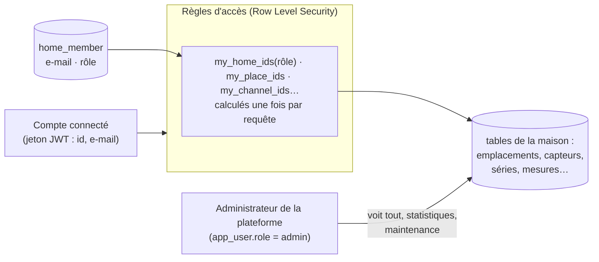
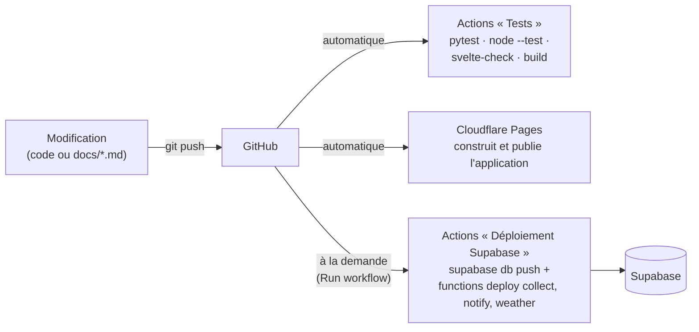
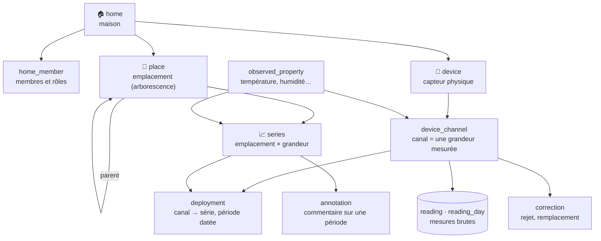

# Architecture et conception de MobAlPlus

MobAlPlus historise les mesures des capteurs **Mobile Alerts** (température, humidité…) au-delà des
3 mois conservés par le service officiel, et les présente dans une application web installable sur
téléphone (PWA). Tout repose sur des **services cloud gérés, sur leurs offres gratuites** : aucune
machine à administrer.

> Les schémas de cette page sont écrits en [Mermaid](https://mermaid.js.org) : du texte dans le
> fichier Markdown, que GitHub dessine automatiquement. Pour les modifier : bouton ✏️ de GitHub sur
> ce fichier (aperçu avec l'onglet *Preview*), ou copier le bloc dans
> [mermaid.live](https://mermaid.live) pour le retoucher avec un aperçu immédiat, puis le recoller.
> draw.io sait aussi importer un bloc Mermaid (*Organiser › Insérer › Avancé › Mermaid*) pour en
> faire un dessin libre.

**Sommaire** · [Vue d'ensemble](#vue-densemble) · [Technologies](#technologies-et-services) ·
[Collecte](#collecte-des-mesures) · [Stockage](#stockage-en-trois-niveaux) ·
[Lecture et affichage](#lecture-et-affichage) · [Application web](#application-web) ·
[Sécurité](#sécurité-et-droits) · [Déploiement](#déploiement) · [Modèle de données](#modèle-de-données)
· [Évolutions](#évolutions-darchitecture-prévues)

---

## Vue d'ensemble

| Brique | Rôle | Code |
|---|---|---|
| Application web (PWA) | valeurs actuelles, courbes, données, administration ; installable | `web/` |
| Base de données | stockage, règles d'accès, calculs (séries, export, import, maintenance) | `supabase/migrations/` |
| Collecteur | récupère les mesures sur le site Mobile Alerts toutes les 10 minutes | `supabase/functions/collect/` |
| Collecteur météo | relève les stations météo publiques (Open-Meteo) toutes les 30 minutes | `supabase/functions/weather/` |
| Outils PC | import des anciens tableurs, rattrapage manuel, tests de la base | `backend/` |
| Documentation | architecture, mise en place, feuille de route, textes de l'application | `docs/` |

Mise en place pas à pas : [supabase-setup.md](supabase-setup.md), puis [deploiement-web.md](deploiement-web.md).

## Technologies et services

| Couche | Produit / technologie | Pourquoi | Offre |
|---|---|---|---|
| Hébergement de l'application | **Cloudflare Pages** | fichiers statiques sur un réseau mondial, construction automatique à chaque push | gratuit |
| Application | **Svelte 5** (runes), **TypeScript**, **Vite 8** | application légère et réactive, construction rapide | libre |
| Mode hors ligne, installation | **vite-plugin-pwa** (Workbox) | service worker, icône sur l'écran d'accueil | libre |
| Courbes | **Apache ECharts 6** (chargé à la demande) | zoom, curseur, plein écran, milliers de points | libre |
| Accès aux données | **supabase-js 2** | authentification et appels à l'API depuis le navigateur | libre |
| Textes de l'application | **marked** | « À propos », nouveautés, aide écrits en Markdown dans `docs/` | libre |
| Import Excel | **read-excel-file** | lecture des fichiers `.xlsx` dans le navigateur | libre |
| Base de données | **PostgreSQL** (Supabase) | SQL, contraintes, fonctions, Row Level Security | gratuit jusqu'à 500 Mo |
| API | **PostgREST** (Supabase) | API REST générée depuis le schéma, appels de fonctions (RPC) | inclus |
| Comptes | **Supabase Auth** (e-mail, Google OAuth) | connexion, jetons JWT lus par les règles d'accès | inclus |
| Tâches planifiées | **pg_cron**, **pg_net**, **Vault** | collecte toutes les 10 min, maintenance chaque nuit, secrets chiffrés | inclus |
| Collecteur | **Supabase Edge Functions** (Deno, TypeScript) | appel du site Mobile Alerts et lecture de ses pages | inclus |
| Météo publique | **Open-Meteo** (prévision, archives ERA5) appelé par le serveur ; géocodage par le navigateur à la création d'une station | stations météo virtuelles, sans clé | gratuit |
| Source des mesures | **Mobile Alerts** (site `measurements.mobile-alerts.eu`) | historique complet des 90 derniers jours | gratuit |
| Code, intégration continue | **GitHub**, **GitHub Actions** | tests à chaque push, déploiement Supabase à la demande | gratuit |
| Outils PC et tests | **Python 3.12**, psycopg, pytest ; **Node 22** (`node --test`) | import des tableurs, tests de la base et du code partagé | libre |

## Collecte des mesures

Le site Mobile Alerts ne fournit pas d'API d'historique : sa page
`Home/MeasurementDetails?deviceid=…&vendorid=…&fromepoch=…&toepoch=…` renvoie en HTML **toutes**
les mesures d'une période. Le collecteur la lit par fenêtres d'un jour.

- **Incrémentale** : chaque capteur reprend là où il s'était arrêté (`device_sync.synced_until`) ;
  après une interruption, le retard (jusqu'à 90 jours) se rattrape sur les passages suivants.
- **Relecture nocturne** des 3 derniers jours, pour les mesures transmises en retard.
- **Heure** : `fromepoch` / `toepoch` sont l'heure *locale* encodée comme de l'UTC ; les dates lues
  sont converties en UTC, avec levée de l'ambiguïté du passage à l'heure d'hiver grâce à l'ordre
  chronologique des mesures (`_shared/timeutil.ts`).
- Le site n'enregistre une mesure que lorsque la valeur change (environ toutes les 7 minutes) :
  le rendu fidèle est donc en **escalier**.
- Les identifiants Mobile Alerts sont des secrets de la fonction, jamais dans le dépôt.

### Météo publique : stations virtuelles

Une **station météo** est un capteur virtuel (`device.vendor = 'open_meteo'`, position `lat` / `lon`)
affecté à un emplacement de type `weather`. Elle passe par le même chemin que les vrais capteurs
(`ingest_readings`, séries, alertes, tendances) ; seul le collecteur diffère :

- Edge Function `weather`, toutes les 30 minutes (pg_cron, minutes 7 et 37) : `weather_targets()`
  donne les stations actives et leur dernière mesure ; un appel Open-Meteo par station (valeurs
  horaires des derniers jours + valeur actuelle) ; à la création, un an d'historique (archives ERA5).
- Les navigateurs ne contactent plus Open-Meteo pour les mesures : pas de risque de blocage, une
  seule requête par station et par demi-heure quel que soit le nombre d'utilisateurs.
- Création : `add_weather_station(maison, nom, lat, lon)` (gestionnaire de la maison), depuis
  Admin › Partage › Météo publique ; l'application lance aussitôt une collecte.

## Stockage en trois niveaux

- Durées réglables (`app_setting` : `hot_days`, `simplify_after_days`), tâche nocturne
  `run_maintenance()` à 3 h 17, journal dans `maintenance_log`.
- **Simplification** : premier et dernier point, minimum et maximum du jour, puis Douglas-Peucker
  sur l'écart vertical avec une tolérance par grandeur (`observed_property.simplify_tolerance` :
  0,2 °C, 2 % ; pluie jamais simplifiée). Les points conservés sont de **vrais points**.
- Les mesures brutes ne sont **jamais modifiées** : corrections et annotations sont à part et
  s'appliquent à la lecture.
- Estimation : 3 ans pour 13 capteurs ≈ 110 Mo, pour un quota gratuit de 500 Mo.

## Lecture et affichage

- **Affectations datées** : le rattachement d'une mesure à un emplacement est calculé à la
  lecture ; déplacer un capteur ou corriger une date ne réécrit aucune mesure.
- **Réduction** : au-delà de 1 000 points, `series_data` renvoie le minimum et le maximum réels de
  chaque intervalle ; les pics restent visibles à toutes les échelles.
- **Calculs dans le navigateur** (rapides, sans charge pour la base) : rendus lissé et simplifié
  (`curve.ts`), moyenne d'un emplacement parent (`placetree.ts`), flèches de tendance et
  inversions (`trend.ts`).

## Application web

- **Copies d'écran** de la documentation (`docs/images/`) : `cd web && npm run screenshots`
  reconstruit l'application en mode démo et la parcourt avec Playwright (`scripts/screenshots.mjs`).
- **Mode démo** : sans variables Supabase, l'application tourne sur des données fictives
  (`demo-api.ts`) ; pratique pour essayer une évolution sans toucher aux vraies données.
- **Préférences** (rendu des courbes, grandeurs masquées, taille du texte, densité, tendances) :
  mémorisées sur l'appareil (`localStorage`).
- **Textes** : `docs/a-propos.md`, `docs/nouveautes.md` et `docs/guide-utilisateur.md` sont intégrés
  à la construction ; les modifier sur GitHub suffit à mettre l'application à jour.

## Alertes et notifications

- Les seuils sont réglés par série (emplacement × grandeur) sur deux niveaux ; un dépassement est
  une alerte **en cours** jusqu'au retour en deçà du seuil d'un pas de mesure (hystérésis) ; un
  refranchissement dans l'heure rouvre la même alerte : une notification par franchissement.
- Les pics et creux reprennent l'algorithme des flèches de tendance (`trend.ts`) ;
  `alerteval.ts` en est la version JavaScript (mode démo, tests).
- Chaque compte archive ses alertes pour lui-même ; l'effacement vaut pour toute la maison.

## Sécurité et droits

| Rôle dans une maison | Peut… |
|---|---|
| **Propriétaire** (`owner`) | tout, y compris inviter, retirer, changer les droits |
| **Gestion** (`editor`) | capteurs, emplacements, corrections, import ; collecte de ses capteurs |
| **Lecture** (`viewer`) | consulter valeurs, courbes, export |

- Les membres sont désignés par leur **e-mail** : une invitation fonctionne avant la première
  connexion, et les droits suivent l'adresse même si le compte est recréé.
- Cohérence garantie par la base : un capteur n'alimente qu'un emplacement de sa maison, une
  maison garde au moins un propriétaire, un emplacement ne peut pas être son propre ancêtre.
- Le collecteur utilise la clé *service_role* ; il n'accepte que le jeton de pg_cron,
  l'administrateur, ou un gestionnaire de maison pour ses propres capteurs (`can_collect`).

## Déploiement

- Une modification de la **base** (nouveau fichier dans `supabase/migrations/`) demande de lancer
  le workflow « Déploiement Supabase » ; l'application, elle, se republie seule.
- Secrets : clés Supabase dans les secrets GitHub et Cloudflare ; identifiants Mobile Alerts dans
  les secrets de l'Edge Function ; URL et jeton de collecte dans le Vault.

## Modèle de données

Vue d'ensemble ci-dessous ; **toutes les tables et colonnes** dans
[modele-donnees.md](modele-donnees.md).

L'idée centrale : le **capteur** (ce qui mesure) est séparé de l'**emplacement** (ce qu'on
regarde). Les mesures sont rattachées au canal du capteur ; la **série** affichée (« Salon –
température ») en reçoit les valeurs selon les **affectations datées**. Ce découpage suit le
standard OGC SensorThings (Thing, Sensor, Location, Datastream, Observation).

## Évolutions d'architecture prévues

À garder en tête dans les choix techniques (détails dans la [feuille de route](ROADMAP.md)) :

- **Plusieurs marques de capteurs** (ROADMAP 16) : un adaptateur par fournisseur dans le
  collecteur (`device.vendor`), et une source pourra aussi *pousser* ses mesures. Le nom de
  l'application ne doit pas reprendre une marque (ROADMAP 14).
- **Règles et actions** (ROADMAP 17) : les alertes (ci-dessus) sont la première brique ; les
  actions s'y brancheront (alert_event → action) :
  e-mail, notification, commande d'appareils (volets Somfy TaHoma, Google Home, Home Assistant,
  webhooks). Identifiants des services tiers par maison, chiffrés.
- **E-mails** (ROADMAP 15) : envoi par un service SMTP / API sur le domaine de l'application,
  réception par Cloudflare Email Routing vers une Edge Function.
