<!--
  Guide d'utilisation affiché dans l'application (page « Aide »). Pour le modifier : éditer ce
  fichier sur GitHub (icône crayon), puis valider (« Commit changes ») ; l'application est
  reconstruite automatiquement en 1 à 2 minutes. Les copies d'écran (docs/images/) se refont avec
  « cd web && npm run screenshots » ; les petits symboles sont dans docs/images/icones/.
-->

# Guide d'utilisation

Les copies d'écran sont regroupées [à la fin](#copies-decran) ; les liens « écran » y renvoient.

## Installer l'application sur le téléphone

MobAlPlus est une application web : elle s'installe depuis le navigateur et s'ouvre ensuite comme
les autres.

- **Android (Chrome)** : menu **⋮** › **Ajouter à l'écran d'accueil** (ou **Installer l'application**).
- **iPhone (Safari)** : bouton **Partager** › **Sur l'écran d'accueil**.

Connexion : **Continuer avec Google**, ou adresse e-mail et mot de passe.

## Maintenant

Une fiche par emplacement : dernière valeur, tendance et ancienneté de la mesure
([écran](#ecran-maintenant)).

-   
  **Tendance** : plus la flèche est inclinée, plus la variation de la dernière heure est forte
  (comparée à l'écart habituel de la journée).
-  
  **Pic ou creux passé** (flèche cassée orange) : la valeur vient de s'inverser. Moment de fermer ou
  d'ouvrir les fenêtres.
- **Alertes** en cours : petite étiquette rouge (⚠ importante) ou bleue (ⓘ info) sous le nom.
- Badge **ancienne** : pas de mesure récente (piles, portée de la passerelle).
- **Emplacement parent** (ex. Jardin) : cadre en pointillé regroupant ses sous-emplacements, avec
  leur **moyenne** ⌀ ; toucher son titre ouvre la page du groupe ([écran](#ecran-groupe)).
- Liseré coloré à gauche : couleur choisie pour l'emplacement dans les courbes.
- **Temp. / Hum.** : n'afficher qu'une grandeur ;
   pour actualiser (sinon toutes les
  2 minutes).

## Courbes

Plusieurs emplacements superposés, une courbe par grandeur ([écran](#ecran-courbes)).

- **Choisir les emplacements** en touchant leurs noms (8 courbes au plus).
- **Emplacement parent** (bouton en pointillé) : **moyenne** de ses sous-emplacements, en tirets.
- **Période** : 24 h à 1 an ; **‹ ›** pour reculer ou avancer ; **Maintenant** pour revenir au présent.
- **Lire une valeur** : toucher la courbe et glisser le doigt.
- **Zoomer** : à deux doigts (ou molette) ; **se déplacer** : faire glisser la barre sous la courbe.
-  **Plein écran**, en haut
  à droite de chaque courbe ([écran](#ecran-plein-ecran)).
- **Rendu** : *Escalier* (fidèle aux mesures), *Lissé*, *Simplifié* (sans les marches dues à
  l'arrondi du capteur).
- Petits triangles : **alertes importantes** (sur ordinateur ou en plein écran).

## Page d'un emplacement

Valeurs actuelles et tendances, courbes, minimum, maximum, moyenne, liste des mesures, capteurs
affectés, **Exporter les données** ([écran](#ecran-emplacement)).

- **Couleur dans les courbes** (droits « gestion ») : palette, gris, marron… ou personnalisée.
- **Seuils d'alerte** : lignes en tirets sur la courbe ; les mesures au-delà sont marquées par des
  points ([écran](#ecran-emplacement-alertes)).

## Alertes

 La **cloche** en haut de l'écran
indique le nombre d'alertes à voir (rouge s'il y en a une importante) et ouvre la liste
([écran](#ecran-alertes)).

**Régler les alertes** : page de l'emplacement, sous chaque courbe, rubrique **Alertes**
(droits « gestion »).

| |  Info |  Importante |
|---|---|---|
| **Au-dessus de** | ex. 26 °C | ex. 28 °C |
| **En dessous de** | ex. 16 °C | ex. 12 °C |
| **Pic passé** | case à cocher | case à cocher |
| **Creux passé** | case à cocher | case à cocher |

- Case vide : pas d'alerte. Les pics et creux suivent la sensibilité des flèches de tendance
  (Options).
- Vérification **toutes les 10 minutes**. **Une seule alerte (et une seule notification) par
  franchissement** : elle reste **en cours** tant que la valeur dépasse, puis se ferme d'elle-même.
  Si la valeur oscille autour du seuil, l'alerte est simplement rouverte pendant l'heure qui suit,
  sans nouvelle notification.

**Liste des alertes** :

- En cours et récentes d'abord ; **Importantes seulement** pour filtrer ; période 7 j, 30 j, 1 an.
- **Glisser une alerte vers la gauche ou la droite** pour l'**archiver** (elle disparaît de votre
  liste seulement) ; **Tout archiver** ; **Archivées** pour les revoir et les **restaurer**.
- **Effacer** (droits « gestion ») : supprime l'alerte pour toute la maison.

**Notifications sur le téléphone** : **Options** › **Notifications des alertes** : *Importantes* ou
*Toutes*. Sur iPhone, installer d'abord l'application sur l'écran d'accueil.

## Données

- **Exporter** : emplacements, grandeurs, période ; fichier CSV (format Excel français par défaut).
- **Importer** (droits « gestion ») : CSV ou Excel au format MobAlPlus, ou ancien tableur Mobile
  Alerts. L'analyse montre les mesures nouvelles, identiques ou en conflit **avant** toute écriture ;
  en cas de conflit, conserver l'existant ou le remplacer.
- Préciser le **fuseau horaire** des dates du fichier ([écran](#ecran-donnees)).

## Options d'affichage

 Icône à réglettes en haut de
l'écran ; réglages propres à chaque appareil ([écran](#ecran-options)).

- **Taille du texte** et **présentation compacte** (2 colonnes de fiches sur téléphone).
- **Grandeurs affichées** et **rendu des courbes**.
- **Flèches de tendance** : période de calcul, sensibilité, écart pour signaler un pic ou un creux.
- **Notifications des alertes** sur cet appareil.

## Partager la maison

**Admin › Partage** (propriétaire) : adresse e-mail de la personne, droits, **Inviter**, puis
envoyer le message proposé par **WhatsApp**, SMS ou e-mail ([écran](#ecran-partage)).

| Droits | Peut… |
|---|---|
| **Lecture** | consulter, exporter, archiver ses alertes |
| **Gestion** | en plus : capteurs, emplacements, seuils d'alerte, import |
| **Propriétaire** | tout, y compris le partage |

## Capteurs et emplacements

- **Admin › Emplacements** : créer les pièces et zones, les ranger les unes dans les autres en les
  **glissant** (ordinateur) ou avec les **flèches** (↑ ↓ ordre, ← sortir, → ranger dans celui du
  dessus) ([écran](#ecran-admin-emplacements)). 📡 signale un emplacement équipé d'un capteur. Un
  **emplacement parent ne reçoit pas de capteur** (il fait la moyenne de ses sous-emplacements) et un
  emplacement équipé ne peut pas contenir d'autres emplacements : l'application le refuse.
- **Admin › Capteurs** : **Ajouter un capteur** (identifiant Mobile Alerts au dos), puis
  **affecter** chaque canal à un emplacement. **Déplacer** : nouvelle affectation datée ;
  **Retirer** : plus relevé, historique conservé.

## Questions fréquentes

**Une valeur est marquée « ancienne ».** Le capteur n'a rien transmis récemment : vérifier ses
piles et la portée de la passerelle. Les mesures manquantes sont récupérées dès qu'il transmet à
nouveau (jusqu'à 90 jours en arrière).

**La courbe fait des marches.** Le capteur arrondit au dixième : rendu *Simplifié*.

**Je ne vois pas la maison qu'on m'a partagée.** Se connecter avec l'adresse exacte invitée ;
choisir la maison dans la liste en haut de l'écran.

**Je ne reçois pas de notification.** Vérifier **Options › Notifications** sur ce téléphone, les
autorisations de notification du navigateur, et qu'un seuil est réglé sur l'emplacement.

## Copies d'écran

Version de démonstration (données fictives). Toucher une image pour
l'agrandir.

<a id="ecran-maintenant" href="images/maintenant.jpg">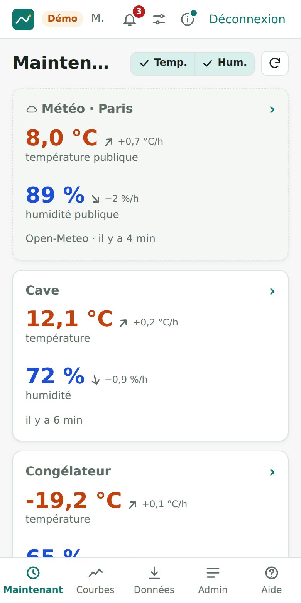</a>
<a id="ecran-groupe" href="images/maintenant-groupe.jpg">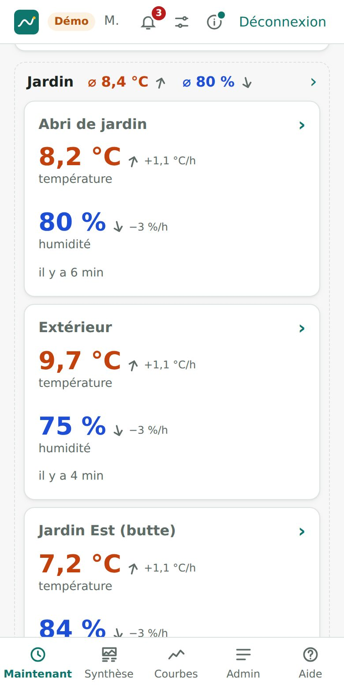</a>
<a id="ecran-compact" href="images/maintenant-compact.jpg">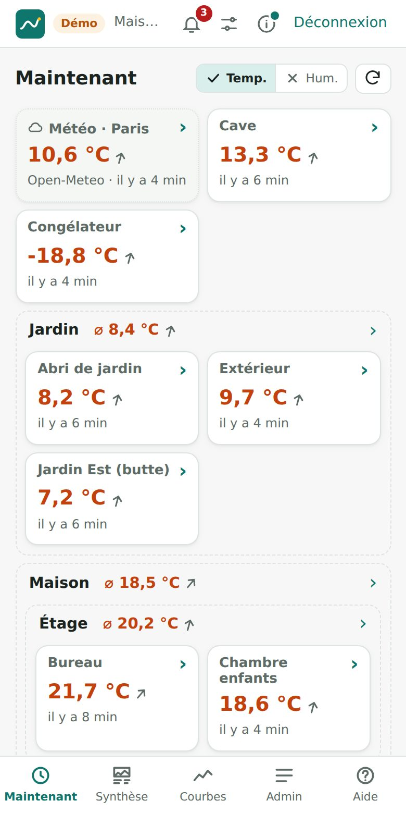</a>
<a id="ecran-courbes" href="images/courbes.jpg">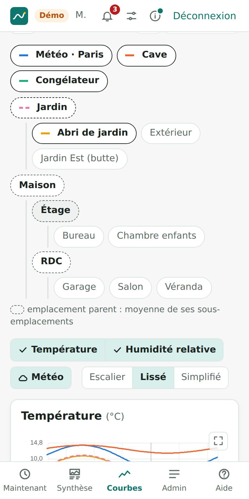</a>
<a id="ecran-courbes-graphique" href="images/courbes-graphique.jpg">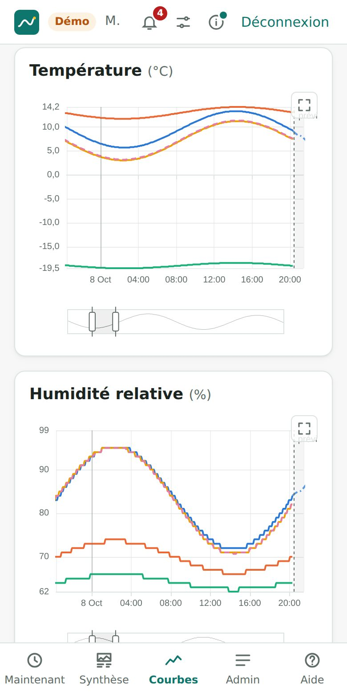</a>
<a id="ecran-emplacement" href="images/emplacement.jpg">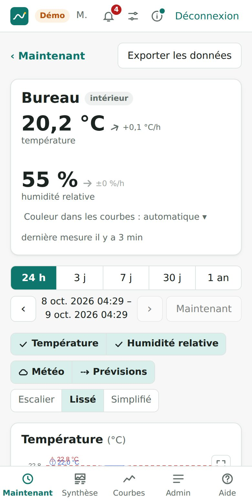</a>
<a id="ecran-emplacement-alertes" href="images/emplacement-alertes.jpg">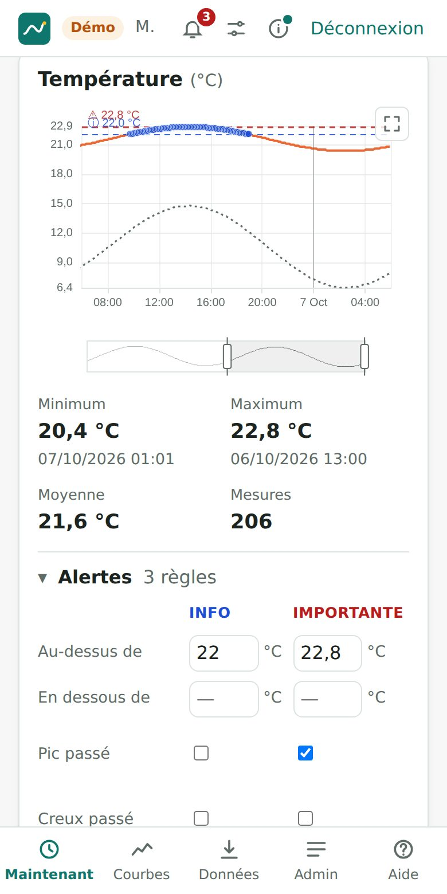</a>
<a id="ecran-alertes" href="images/alertes.jpg">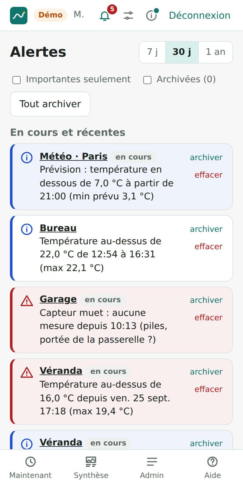</a>
<a id="ecran-page-groupe" href="images/groupe.jpg">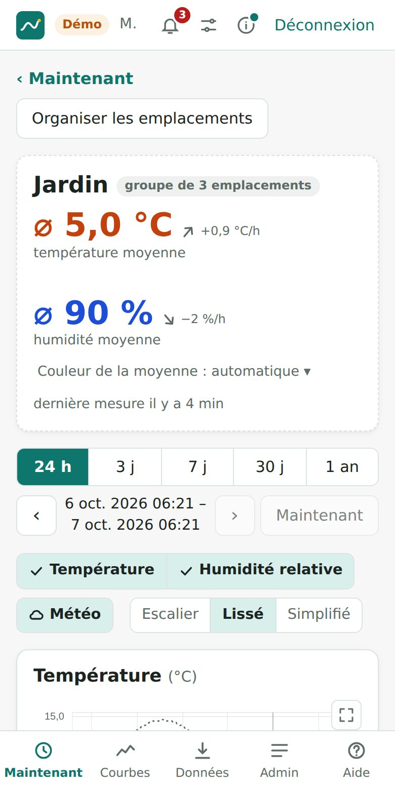</a>
<a id="ecran-donnees" href="images/donnees.jpg">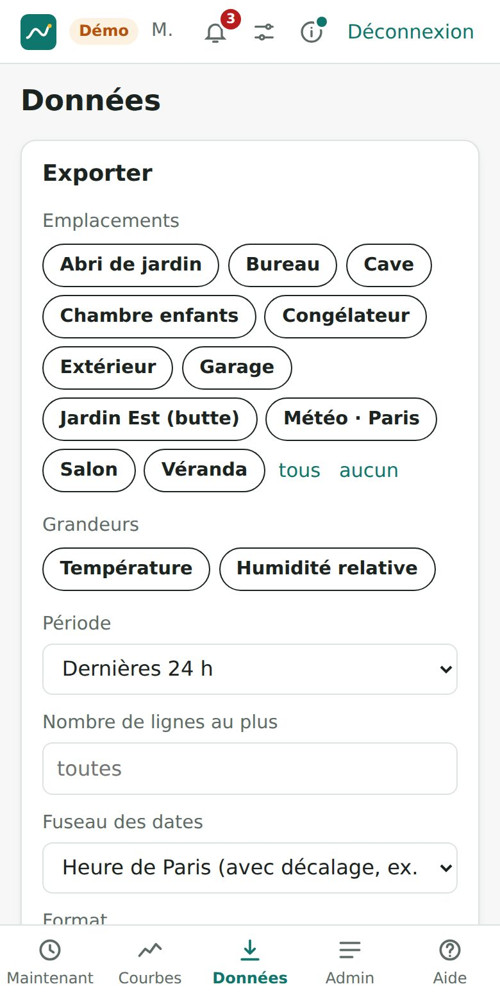</a>
<a id="ecran-options" href="images/options.jpg">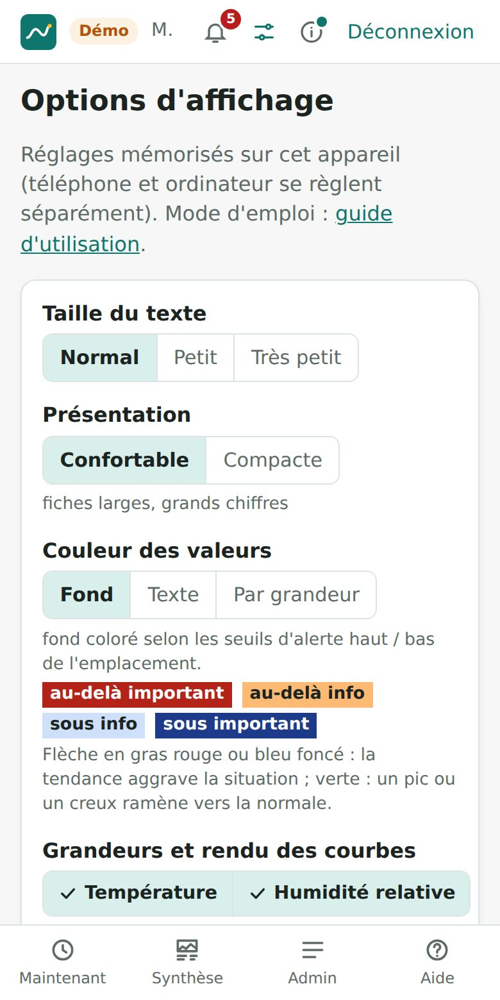</a>
<a id="ecran-tendances" href="images/options-tendances.jpg">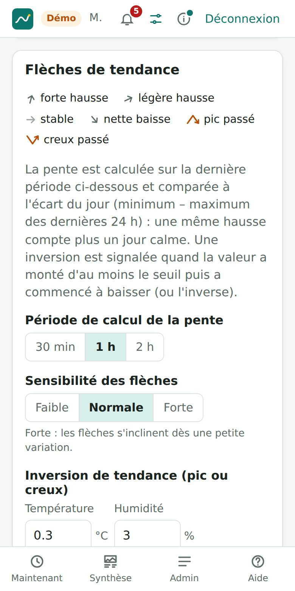</a>

<a id="ecran-admin-emplacements" href="images/admin-emplacements.jpg">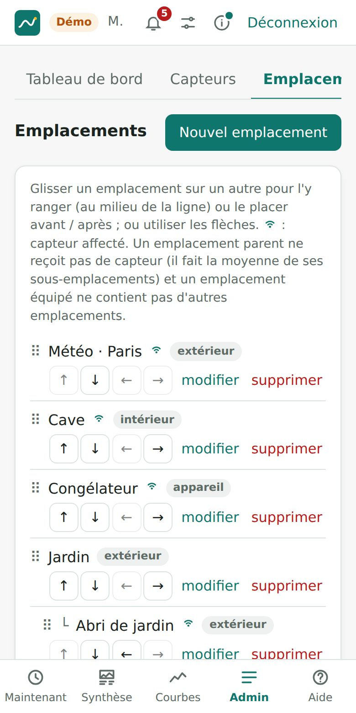</a>
<a id="ecran-plein-ecran" href="images/plein-ecran.jpg">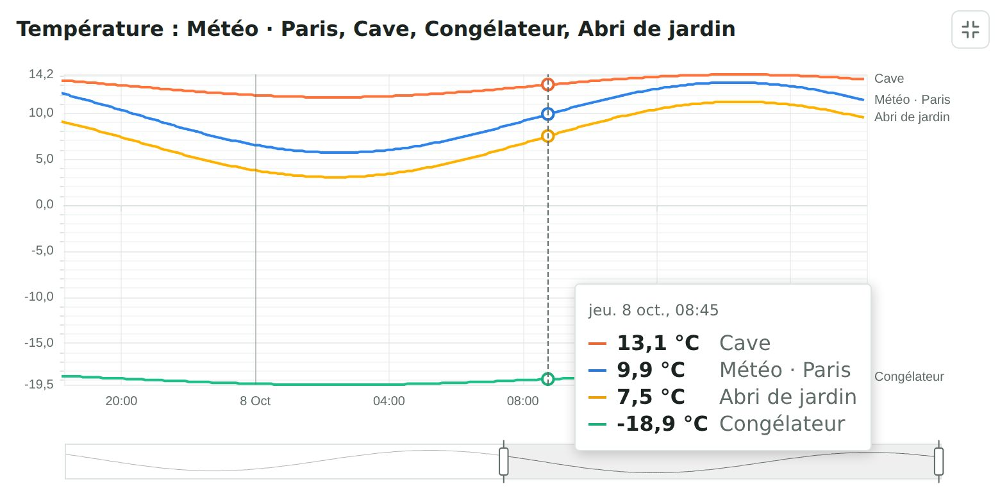</a>

