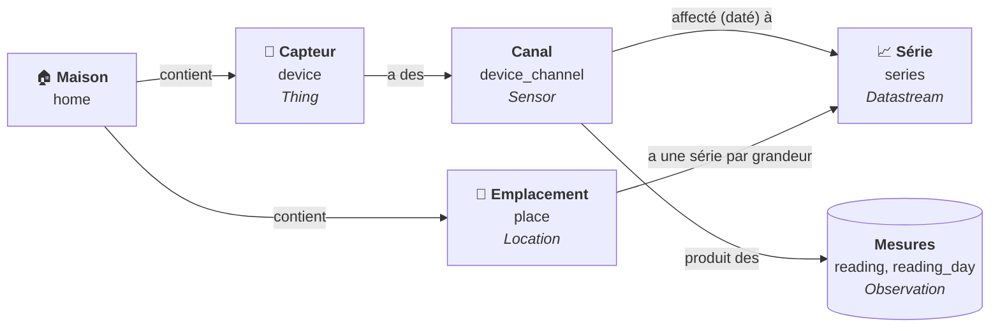
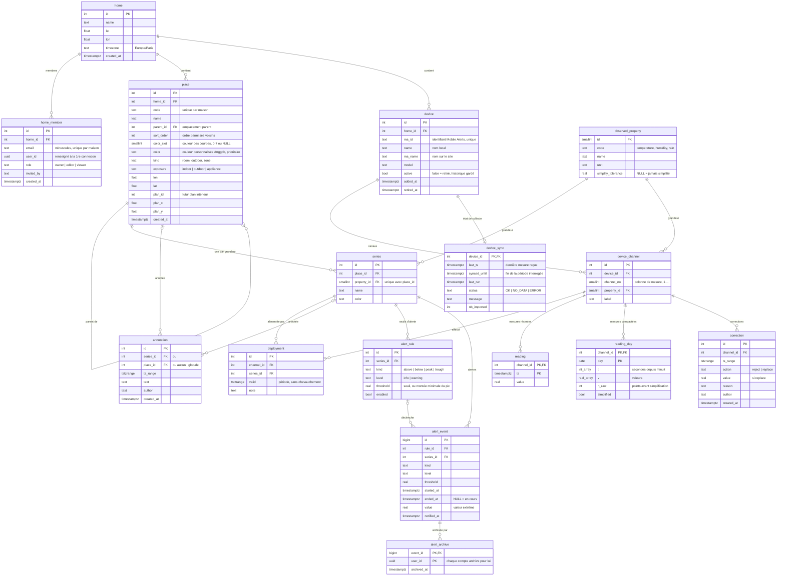
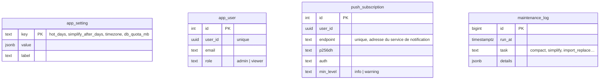

# Modèle de données

Base PostgreSQL (Supabase). Schéma défini par les fichiers de `supabase/migrations/`, appliqués dans
l'ordre de leur nom. Vue d'ensemble dans [architecture.md](architecture.md#modèle-de-données).

> Schémas en [Mermaid](https://mermaid.js.org) : modifiables directement sur GitHub (✏️) ou dans
> [mermaid.live](https://mermaid.live). Penser à les mettre à jour avec chaque nouvelle migration.

## Vue synthétique

Les cinq notions à retenir, et leur équivalent dans le standard OGC SensorThings :

- Un **capteur** (ex. une sonde thermo-hygro) a un ou plusieurs **canaux**, chacun mesurant une
  grandeur (température, humidité…).
- Un **emplacement** (Salon, Jardin…) a une **série** par grandeur : c'est la courbe affichée.
- Une **affectation** (`deployment`) relie un canal à une série pendant une période : déplacer ou
  remplacer un capteur, c'est fermer une affectation et en ouvrir une autre ; l'historique de la
  série reste continu.
- Les **mesures** sont stockées par canal, jamais modifiées ; corrections et annotations sont à part.

## Schéma détaillé

Tables techniques, sans lien avec les autres :

## Tables

| Table | Contenu | Points importants |
|---|---|---|
| `home` | maison : regroupe emplacements et capteurs | toutes les règles d'accès partent d'elle |
| `home_member` | membres d'une maison, par e-mail | invitation possible avant la 1re connexion ; au moins un propriétaire |
| `place` | emplacements, en arborescence | même maison que son parent ; pas de boucle ; ordre `sort_order` ; un emplacement parent n'a pas de capteur affecté (et un emplacement équipé ne contient pas d'autres emplacements) |
| `device` | capteurs physiques | `active = false` : plus collecté, historique conservé |
| `device_channel` | canaux d'un capteur (une grandeur chacun) | créés automatiquement à la 1re collecte |
| `observed_property` | grandeurs mesurées | tolérance de simplification par grandeur |
| `series` | courbe d'un emplacement pour une grandeur | une seule par couple emplacement × grandeur |
| `deployment` | affectation datée canal → série | contraintes d'exclusion : un canal à un seul endroit, une série à une seule source à la fois |
| `reading` | mesures récentes, une ligne par valeur | clé (canal, horodatage) : pas de doublon |
| `reading_day` | mesures anciennes, une ligne par canal et par jour | tableaux `t` / `v` ; `simplified` au-delà de 3 ans |
| `correction` | valeurs rejetées ou remplacées | appliquées à la lecture, le brut reste intact |
| `annotation` | commentaires sur une période | par série, par emplacement ou globaux |
| `alert_rule` | seuils d'alerte d'une série (au-dessus, en dessous, pic, creux ; info ou importante) | une règle par type et niveau |
| `alert_event` | alertes déclenchées | en cours tant que `ended_at` est vide ; effacement réservé à « gestion » |
| `alert_archive` | alertes archivées (masquées) | propre à chaque compte |
| `push_subscription` | appareils abonnés aux notifications | supprimés quand le service les déclare expirés |
| `device_sync` | avancement de la collecte par capteur | reprise incrémentale, dernière erreur |
| `maintenance_log` | journal des tâches (compactage, simplification, remplacements à l'import) | consultable dans Admin › Maintenance |
| `app_setting` | réglages (durées de conservation, fuseau, quota) | modifiables par l'administrateur |
| `app_user` | administrateurs de la plateforme | rôle reconnu par l'e-mail du compte |

## Vues et fonctions principales

| Nom | Rôle |
|---|---|
| `reading_all`, `channel_readings()` | mesures d'un canal, tous niveaux de stockage réunis |
| `observation`, `series_observations()` | mesures d'une série : affectations et corrections appliquées |
| `series_data()`, `series_data_multi()` | points d'une courbe, réduits en min / max par intervalle si nécessaire |
| `series_stats()`, `series_bounds()` | minimum, maximum, moyenne ; première et dernière mesure |
| `current_values()` | dernière valeur de chaque série (page Maintenant) |
| `collect_targets()`, `ingest_readings()`, `record_sync_error()` | collecteur |
| `run_maintenance()`, `compact_readings()`, `simplify_old()` | maintenance nocturne |
| `assign_channel()`, `retire_device()`, `reorder_places()` | administration |
| `place_issues()` | emplacements parents ayant encore un capteur affecté (incohérence ancienne à corriger) |
| `export_csv()`, `import_preview()`, `import_values()` | export et import de fichiers |
| `my_context()`, `my_home_ids()`, `my_place_ids()`… | droits du compte connecté (règles d'accès) |
| `evaluate_alerts()`, `set_alert_rules()` | alertes : évaluation toutes les 10 minutes, réglage des seuils |
| `pending_notifications()`, `mark_notified()` | notifications à envoyer (Edge Function `notify`) |
| `admin_stats()`, `stats()` | statistiques d'occupation |
